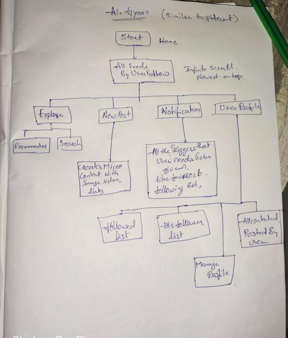

# Notes from SRAVAN on discord server => 06/10/2020

# Notes from SuperSic on discord server =>  07/10/2020

## User Profile

Pic, Bio, category, my posts, my liked posts, edit profile

## Text editor

 via text editor users can write text, upload image etc. 
Posts should have a lmit of 250 words only. 

## Actions

Users can like, comment, share a post and follow favorite creators, etc

## Filters

Users can see posts of their preferences that is if they can choose digital marketing then they will get to see only digital marketing. 

## Notifications tab

If anyone liked, comment, mentioned you, share your posts, etc. You will get an notifications.

these are the features @Joaquín :point_up_2_tone1:

# Notes also from SuperSic on discord server => 14/10/2020

[Skeleton pic of the app](UIUX.pdf)

[Basic card skeleton](https://airgyaan.bss.design/profile.html)
